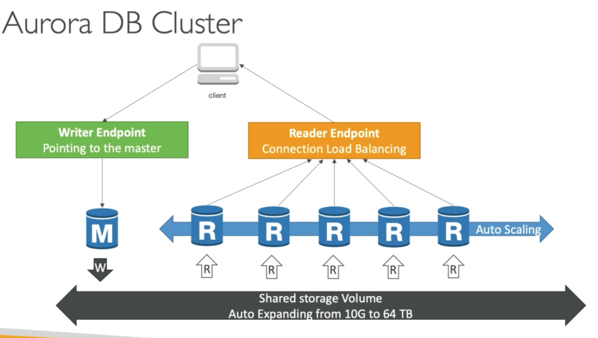

## AWS RDS (Relational Database Service)

### Overview

It's a managed DB service for DB use SQL as a query language.

- Postgres/ MySQL/ MariaDB/ Oracle/ Microsoft SQL Server/ Aurora (AWS Proprietary database) 

#### Advantage over using RDS versus deploying DB on EC2

- RDS is a managed service:
  - Automated provisioning, OS patching
  - Continuous backups and restore to specific timestamp (Point in time Restore)!
  - Monitoring dashboards
  - Read replicas for improved read performance
  - Multi AZ setup for DR (Disaster Recovery)
  - Maintenance windows for upgrades
  - Scaling capability (vertical and horizontal)
  - Storage backed by EBS (gp2 or io 1)
- BUT you can't SSH into your instances

#### RDS Backups

Backups are automatically enabled in RDS.

- Daily full backup of the database (during the maintenance window)
- Transaction logs are backed-up by RDS every 5 mins
  - => ability to restore to any point in time (from oldest backup to 5 mins ago)
- 7 days retention (can be increased to 35 days)

#### DB Snapshots

Manually triggered by the user. Retention of backup for as long as you want.

### RDS Read Replicas for read scalability

Up to 5 Read Replicas within AZ, cross AZ or cross Region. Replication is ASYNC so reads are eventually consistent. Replicas can be promoted to their own DB. 

Applications must update the connection string to leverage read replicas.

Read replicas are used for SELECT (=read) only kind of statements (not INSERT, UPDATE, DELETE)

#### RDS Read Replicas - Use Cases

Want to run a reporting application to run some analytics besides normal load. 

You can create a Read Replica to run the new workload there and the production is not affected. 

#### RDS Read Replicas - Network Cost

Replicas across AZ is costly! within the same AZ is free. 

#### RDS Multi AZ (Disaster Recovery)

- SYNC replication.
- One DNS name - automatic app failover to standby.
- Increase availability: Failover in case of loss of AZ, loss of network, instance or storage failure
- No manual intervention in apps
- Not used for scaling

### RDS Security - Encryption

At rest encryption:

- Possibility to encrypt the master & read replicas with AWS KMS - AES-256 encryption.
- Encryption has to be defined at launch time.
- If the master is not encrypted, the read replicas **cannot** be encrypted.
- Transparent Data Encryption (TED) available for Oracle and SQL Server (NOT PostgreSQL or MySQL!).

In-flight encryption:

- SSL certificates to encrypt data to RDS in flight.
- Provide SSL options with trust certificate when connecting to database
- To enforce SSL:
  - PostreSQL: rds.force_ssl=1 in AWS RDS Console (Parameter Groups)
  - MySQL: Within the DB -  `GRANT USAGE ON *.* TO 'mysqluser'@'%' REQUIRE SSL; `

#### RDS Encryption Operations

- Encrypting RDS backups
  - Snapshots of (un-)encrypted RDS databases are (un-)encrypted
  - Can copy a snapshot into an encrypted one
-  To encrypt an un-encrypted RDS database:
  - Create a snapshot of the un-encrypted database
  - Copy the snapshot and enable encryption for the snapshot
  - Restore the database from the encrypted snapshot
  - Migrate applications to the new db, and delete the old db

### RDS Security - Network

- RDS db are usually deployed within a private subnet, not in a public one
- RDS security works by leveraging security groups (the same concept as for EC2 instances) - it controls which IP / security group can communicate with RDS

### RDS Security - Access Management (IAM)

- IAM policies help control who can manage AWS RDS (through the RDS API)
- Traditional Username and pwd can be used to login to the db
- IAM-based authentication can be used to login into RDS MySQL & PostgreSQL

#### RDS - IAM Authentication

IAM db authentication works with MySQL and PostgreSQL. 

- Using an authentication token obtained through IAM & RDS API calls, which has a lifetime of 15 minutes

Benefits:

- Network IO must be encrypted using SSL
- IAM to centrally manage users instead of DB
- Can leverage IAM Role and EC2 instance profile for easy integration

## Amazon Aurora

Aurora is a proprietary technology from AWS (not open sourced). Postgres and MySQL are both supported as Aurora DB, which means your driver will work as if Aurora was a Postgres or MySQL db).

- It is "AWS cloud optimised" and claims 5x performance improvement over MySQL on RDS, over 3x the performance of Postgres on RDS.
- Aurora storage automatically grows in increments of 10 GB, up to 64 TB.
- Aurora can have 15 replicas while MySQL has 5, and the replication process is faster (sub 10 ms replica lag)
- Failover in Aurora is instantaneous. It's HA native.
- Aurora costs more than RDS (20%more) - but is more efficient.

### Aurora High Availability and Read Scaling

- 6 Copies of your data across 3 AZ:
  - 4 copies out of 6 needed for writes
  - 3 copies out of 6 need for reads
  - Self healing with peer-to-peer replication
  - Storage is striped across 100s of volumes
- One Aurora instance takes writes (master)
  - Automated failover for master in less than 30s
- Master + up to 15 Aurora Read Replicas serve reads (Auto scaling)
- Support for Cross Region Replication

### Aurora DB Cluster

- Writer Endpoint (pointing to the master)
- Reader Endpoint (Connection Load Balancing)



### Features of Aurora

- Automatic fail-over
- Backup and Recovery
- Isolation and security
- Industry compliance
- Push-button scaling
- Automated Patching with Zero Downtime
- Advanced Monitoring
- Routine Maintenance
- Backtrack: restore data at any point of time without using backups

#### Aurora Security

Similar to RDS because uses the same engines.

- Encryption at rest using KMS.
- Automated backups, snapshots and replicas are also encrypted.
- Encryption in flight using SSL (same process as MySQL or Postgres)
- Possibility to authenticate using IAM token (same method as RDS)

You are responsible for protecting the instance with security groups. You can't SSH.

### Aurora Serverless

Automated db instantiation and auto-scaling based on actual usage.

- Good for infrequent intermittent or unpredictable workloads.
  - No capacity planning needed
  - Pay per second, can be more cost-effective

### Global Aurora

Aurora Cross Region Read Replicas:

- Useful for disaster recovery
- Simple to put in place

Aurora Global DB (recommended):

- 1 Primary Region (read/ write)
- Up to 5 secondary (read-only) regions, replication lag is less than 1 second
- Up to 16 Read Replicas per secondary region
- Helps for decreasing latency
- Promoting another region (for disaster recovery) has an RTO of < 1 minute

## AWS ElastiCache

The same way RDS is to get managed Relational DBs, ElastiCache is to get managed Redis or Memcached. Caches are in-memory dbs with really high performance, low latency. It helps reduce load off of dbs for read intensive workloads and make your application stateless.

- Write Scaling using sharding
- Read Scaling using Read Replicas
- Multi AZ with Failover Capability
- AWS tasks care of OS maintenance/ patching, optimisations, setup, configuration, monitoring, failure recovery and backups.

### ElastiCache Solution Architecture

#### DB Cache

Apps queries ElastiCache, if not available get from RDS and store in ElastiCache.

- Hleps relieve load in RDS
- Cache must have an invalidation strategy to make sure only the most current data is used in there

#### User Session Store

User logs into any of the App. The App writes the session data into ElastiCache. The user hits another instance of our App. the instance retrieves the data and the user is already logged in.

### ElastiCache - Redis vs Memcached

**Redis**

- Multi AZ with Auto-Failover
- Read Replicas to scale read and high availability
- Data Durability using AOF persistence
- Backup and restore features 

**Memcached**

- Multi-node for partitioning of data (sharding)
- Non persistent
- No backup and restore
- Multi-threaded architecture  

### ElastiCache Strategies

[Read More](https://aws.amazon.com/caching/implementation-considerations)

- Is it safe to cache data? Data may be out of date, eventually consistent.

- Is caching effective for that data?
  - Pattern: data changing slowly, few keys are frequently needed
  - Anti patterns: data changing rapidly, all large key space frequently needed
- Is data structured well for caching?
  - e.g.: key value caching, or caching of aggregations results

#### Which caching design pattern is the most appropriate?

##### Lazy Loading/ Cache-Aside/ Lazy Population

1. Cache hit (Done!)
2. Cache miss
   1. Read from DB
   2. Write to cache

**Pros**

Only requested data is cached. Node failures are not fatal (just increased latency to warm the cache).

**Cons**

- Cache miss penalty that results in 3 round trips, noticeable delay for that request.
- Stale data: data can be updated in the db and outdated in the cache.

**Code example**

```python
def get_user(user_id):
	record = cache.get(user_id)
	
	if record is None:
		record = db.query("select * from users where id = ?", user_id)
		cache.set(user_id, record)

	return record
user = get_user(17)
```

##### Write Through - Add or Update cache when db is updated

Writing to cache while writing to DB.

**Pros**

- Data in cache is never stale, reads are quick.
- Write penalty vs Read penalty (each write requires 2 calls)

**Cons**

- Missing data until it is added / updated in the DB. Mitigation is to implement Lazy Loading strategy as well.
- Cache churn - a lot of data will never be read

**Code example**

```python
def save_user(user_id, values):
	record = db.query("update users ... where id = ?", values)
	cache.set(user_id, record)
	
	return record

user = save_user({17, {"name": "Nate Dogg"})
```

#### Cache Evictions and Time-to-live (TTL)

Cache eviction can occur in 3 ways:

- You delete the item explicitly in the cache
- Item is evicted because the memory is full and it's not recently used (LRU)
- You set an item time-to-live (or TTL)

TTL can range from few seconds to hours or days. It's helpful for any kind of data: Leaderboards, Comments, Activity streams... 

If too many evictions happen due to  memory, you should scale up or out

#### Summary

- Lazy Loading/ Cache aside is easy to implement and works for many situations as a foundation, especially on the read side.
- Write-through is usually combined with Lazy Loading as targeted for the queries or workloads taht benefit from this optimisation
- Setting a TTL is usually not a bad idea, except when you're using Write-through. Set it to a sensible value for your app.
- Only cache the data that makes sense (user profiles, blogs, etc...)

Quote: There are only two hard things in Computer Science:  cache invalidation and naming things.