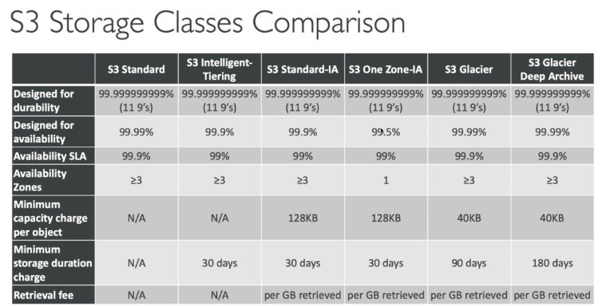
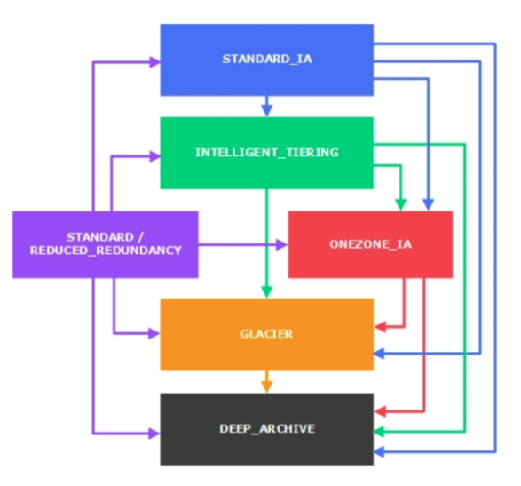

## Amazon S3

One of the main building blocks of AWS. 

### S3 Buckets

Directories.

- Buckets are defined at the region level
- Buckets must have a globally unique name (which means including someone else's bucket name).
- Naming convention
  - No uppercase
  - No underscore
  - 3-63 chars long
  - Not an IP
  - Must start with lowercase letter or number

### Objects

Objects (Files) have a key. The key is the FULL path, which is composed of prefix + object name, e.g. s3://my-bucket/my_folder/another_folder/my_file.txt.

Here `my_folder/another_folder/` is the prefix. There's no concept of "directories" within buckets, just keys with very long names that contain slashes.

- Object values are the content of the body
  - Max object size is 5TB
  - If uploading more than 5GB, must use "multi-part upload"
- Metadata (list of text key / value pairs - system or user metadata)
- Tags (Unicode key / value pair - up to 10) - useful for security / lifecycle
- Version ID (if versioning is enabled)

### S3 Versioning

It is enabled at the bucket level. Same key overwrite will increment the "version": 1, 2, 3...

It's best practice to version you buckets:

- Protect against unintended deletes
- Easy roll back to previous version

Notes:

- Any file that is not versioned prior to enabling versioning will have version "null"
- Suspending versioning does not delete the previous versions

### S3 Encryption for Objects

4 methods of encrypting S3 objects:

- SSE-S3: encrypts S3 objects using keys handled & managed by AWS
  - Ojbect is encrypted server side
  - AES-256 encryption type
  - Must set HTTP/S header: "x-amz-server-side-encruption":"AES256"
- SSE-KMS: encryption using keys handled & managed by AWS Key management Service
  - KMS Advantages: user control + audit trail
  - Object is encrypted server side
  - Must set HTTP/S header: "x-amz-server-side-encryption":"aws:kms"
- SSE-C: server-side encryption using data keys fully managed by the customer outside of AWS (when you want to manage your own encryption keys)
  - Amazon S3 does not store the encryption key you provide
  - HTTPS is mandatory for SSE-C.
  - Provided content + Encryption key in HTTP headers, for every HTTP request made
- Client Side Encryption
  - Client library such as the Amazon S3 Encryption client might be helpful
  - Clients must encrypt data themselves before sending to S3
  - Clients must decrypt data themselves when retrieving from S3
  - Customer fully manages the keys and encryption cycle

#### Encryption in transit (SSL/ TLS)

Encryption in flight is also called SSL/ TLS

Amazon S3 exposes:

- HTTP endpoint: non encrypted
- HTTPS endpoint: encrypted in flight

You are free to use the endpoint you want, but HTTPS is recommended. Most clients would use the HTTPS endpoint by default.

### S3 Security

User Based

- IAM policies - which API calls should be allowed for a specific user from IAM console

Resource Based

- Bucket Policies - bucket wide rules from the S3 console - allows cross account
- Object Access Control List (ACL) - fine grain
- Bucket Access Control List (ACL): less common

**Note:** an IAM principal can access an S3 object if the user IAM permissions allow it or the resource policy ALLOWS it and there's no explicit DENY.

#### S3 Bucket Policies

JSON based policies. 

#### Bucket settings for Block public access

#### Other

- Networking:
  - Supports VPC Endpoints (for instances in VPC without www internet)
- Logging and Audit:
  - S3 Access Logs can be stored in other S3 bucket
  - API calls can be logged in AWS CloutTrail
- User Security:
  - MFA Delete: MFA can be required in versioned buckets to delete objects
  - Pre-Signed URLs: URLs that are valid only for a limited time (ex: premium video service for logged in users)

### S3 Websites

S3 can host static websites and have them accessible on the www. The website URL will be `<bucket-name>.s3-website-<AWS-region>.amazonaws.com` or `<bucket-name>.s3-website.<AWS-region>.amazonaws.com`.

If you get a 403 (Forbidden) error, make sure to make the bucket public and make the bucket policy allows public reads (GetObject) !

#### CORS

An origin is a scheme (protocol, e.g. https), host (domain) and port. CORS means Cross-Origin Resource Sharing. Web Browser based mechanism to allow requests to other origins while visiting the main origin.

Same origin: http://example.com/app1 & http://example.com/app2.

Different origins: http://www.example.com & http://other.example.com.

The request won't be fulfilled unless the other origin allows for the requests, using CORS Headers (ex: Acess-Control-Allow-Origin)

#### S3 CORS

If a client (from say asset bucket) does a cross-origin request on our S3 bucket, we need to enable the correct CORS headers in our bucket.  

```xml
<CORSConfiguration>
  <CORSRule>
    <AllowedOrigin>http://assetbucketname.s3-website-eu-west-1.amazonaws.com</AllowedOrigin>
    <AllowedMethod>GET</AllowedMethod>
    <MaxAgeSeconds>3000</MaxAgeSeconds>
    <AllowedHeader>Authorization</AllowedHeader>
  </CORSRule>
</CORSConfiguration>
```

### S3 - Consistency Model

Amazon S3 is a eventually consistent system.

- It promise "Read after write" consistency for PUTS of **new** objects
  - As soon as a new object is written, we can retrieve it, e.g. (PUT 200 => GET 200)
  - Except if we did a GET before to see if the object existed, e.g. (GET 404 => PUT 200 => **GET 404**) - will get eventually consistent
- Eventual Consistency for DELETES and PUTS of existing objects
  - If we read an object after updating, we might get the older version, e.g. (PUT 200 => PUT 200 => GET 200 (might be older version))
  - If we delete an object, we might still be able to retrieve it for a short time, e.g. (DELETE 200 => GET 200)

Note: there's no way to request "strong consistency".

### S3 MFA-Delete

MFA (multi factor authentication) forces user to generate a code on a device (usually a mobile phone or hardware) before doing important operations on S3. To enable MFA-delete, versioning must be enabled. You will need MFA to

- permanently delete an object version
- suspend versioning on the bucket

You won't need MFA for:

- enabling versioning
- listing deleted versions

Only the bucket owner (root account) can enable/disable MFA-Delete. And currently can only be enabled using the CLI.

```shell
$ aws s3api put-bucket-versioning --bucket bucket-name --versioning-configuration Status=Enabled,MFADelete=Enabled --mfa "arn-of-mfa-device mfa-code"
```

### S3 Default Encryption

The old way to enable default encryption was to use a bucket policy and refuse any HTTP command without the proper headers.

```json
{
	"Version": "2012-10-17",
	"Id": "PutOjbectPolicy",
  "Statement": [
    {
      "Sid": "DenyIncorrectEncryptionHeader",
      "Effect": "Deny",
      "Principal": "*",
      "Action": "s3:PutObject",
      "Resource": "arn:aws:s3::<bucket_name>/*",
      "Condition": {
        "StringNotEquals": {
          "s3:x-amz-server-side-enctyption": "AES256"
        }
      }
    },
    {
      "Sid": "DenyUnEncryptedObjectUploads",
      "Effect": "Deny",
      "Principal": "*",
      "Action": "s3:PubObject",
      "Resource": "arn:aws:s3::<bucket_name>/*",
      "Condition": {
        "Null": {
          "s3:x-amz-server-side-encryption": true
        }
      }
    }
  ]
}
```

Note: Bucket Policies are evaluated before "default encryption".

### S3 Access Logs

Log all access to S3 buckets. Any request made to S3, from any account, authorised or denied, will be logged into another S3 bucket. That data can be analysed using data analysis tools or Amazon Athena.

The log format is at: [https://docs.aws.amazon.com/AmazonS3/latest/dev/LogFormat.html]()

**Warnings:**

- Do not set your logging bucket to be the monitored bucket

### S3 Replication

- Must enable versioning in source and destination.
- Buckets can be in different accounts.
- Must give proper IAM permissions to S3.
- Copying is asynchronous

#### Two types

- Cross Region Replication (CRR)
  - Use cases: compliance, lower latency access, replication across accounts.

- Same Region Replication (SRR)
  - U se cases: log aggregation, live replication between production and test accounts

#### Notes

- After activating, only new objects are replicated (not retroactive)
- For DELETE operations
  - If you delete without a version ID, it adds a delete marker, not replicated
  - If you delete with a version ID, it deletes in the source, not replicated
- There is no "chaining" of replication
  - If bucket 1 has replication into bucket 2, which has replication into bucket 3, then objects created in bucket 1 are not replicated to bucket 3

### S3 pre-signed URLs

- Can generate pre-signed URLs using SDK or CLI
  - For downloads (easy, can use the CLI)
  - For uploads (harder, must use the SDK)

- Valid for a default of 3600 seconds, can change timeout with `--expires-in [TIME_BY_SECONDS]` argument
- Users given a pre-signed URL inherit the permissions of the person who generated the URL for GET/ PUT

#### Examples

- Allow only logged in users to download a premium video on your S3 bucket
- Allow an ever changing list of users to download files by generating URLs dynamically
- Allow temporarily a user to upload a file to a precise location in our bucket

```shell
$ aws configure set default.s3.signature_version s3v4  // allows to generate URL to be compatable with KMS
$ aws s3 presign s3://my-sample-bucket/file_name --expires-in 300 --region ap-southeast-2  // region must be specified
```

### S3 Storage Classes

All classes has high durability (99.999999999%) of objects across multiple AZ. Which means if you store 10 million objects with Amazon S3, you can on average expect to incur a loss of a single object once every 10,000 years.

#### Amazon S3 Standard - General Purpose

- 99.99% Availability over a given year
- Sustain 2 concurrent facility failures
- Use Cases: Big Data analytics, mobile & gaming applications, content distribution...

#### Amazon S3 Standard-Infrequent Access (IA)

- Suitable for data that is less frequently accessed, but  requires rapid access when needed.

- 99.9% Availability
- Low cost compared to Amazon S3 Standard
- Sustain 2 concurrent facility failures
- Use Cases: As a data store for disaster recovery, backups...

#### Amazon S3 One Zone-Infrequent Access 

- Same as IA but data is stored in a single AZ.
- 99.5% Availability
- Low latency and high throughout performance
- Support SSL for data at transit and encryption at rest
- Low cost compared to IA (by 20%)
- Use Cases: Storing secondary backup copies of on-premise data, or storing data you can recreate

#### Amazon S3 Intelligent Tiering

- Same low latency and high throughput performance of S3 Standard
- Small monthly monitoring and auto-tiering fee
- Automatically moves objects between two access tiers based on changing access patterns (General Purpose <=> IA)
- Resilient against events that impact an entire AZ
- Designed for 99.9% availability over a given year

#### Amazon Glacier

- Low cost object storage meant for archiving/ backup
- Data is retained for the longer term (10s of years)
- Alternative to on-premise magnetic tape storage
- The same durability
- Cost per storage per month ($0.004 / GB) + retrieval cost
- Each item in Glacier called "Archive" (up to 40TB)
- Archives are stored in "Vaults"

3 retrieval options (Minimum storage duration of 90 days):

- Expedited (1 to 5 minutes)
- Standard (3 to 5 hours)
- Bulk (5 to 12 hours)

#### Amazon Glacier Deep Archive

For long term storage (Minimum storage duration of 180 days) - cheaper:

- Standard (12 hours)
- Bulk (48 hours)



#### Amazon S3 Reduced Redundancy Storage (deprecated - omitted)

#### S3 - Moving between storage classes

You can transition objects between storage classes as illustrated bellow:



- Move infrequently accessed object into "STANDARD_IA"
- Move archive objects that don't need in real-time to "GLACIER" or "DEEP_ARCHIVE"

Moving objects can be automated using a *lifecycle configuration*.

### S3 - Lifecycle rules

Rules can be created for a certain prefix (ex - s3://mybucket/mp3/*) or certain objects tags (ex - Department: Finance) 

- **Transition actions:** It defines when objects are transitioned to another storage class.
  - Move objects to Standard IA class 60 days after creation
  - Move to Glacier for archiving after 6 months
- **Expiration actions:** configure objects to expire (delete) after some time
  - Access log files can be set to delete after a 365 days
  - Can be used to delete old versions of files

### S3 - Baseline Performance

Amazon S3 automatically scales to high request rates, latency 100-200ms. Your application can achieve at least 3500 PUT/COPY/POST/DELETE and 5500 GET/HEAD requests per second per prefix in a bucket.

Example (object path => prefix):

- bucket/folder1/sub1/file => /folder1/sub1/
- bucket/folder1/sub2/file => /folder1/sub2/

#### S3 - KMS Limitation

If you use SSE-KMS, you may be impacted by the KMS limits. When you upload, it calls the `GenerateDataKey` KMS API. When you download, it calls the `Decrypt` KMS API.

Count towards the KMS quota per second (5500, 10000, 30000 req/s based on region). As of today, you cannot request a quota increase for KMS.

#### S3 Performance

- Multi-Part upload:
  - recommended for files > 100MB, must use for files > 5GB
  - Can help parallelise uploads (speed up transfers)
- S3 Transfer Acceleration (upload only)
  - Increase transfer speed by transferring file to an AWS edge location which will forward the data to the S3 bucket in the target region. 
    - e.g. upload File in USA to an Edge Location in USA through public internet then transfer it to the target region through private AWS network.
  - Compatible with multi-part upload
- S3 Byte-Range Fetches
  - Parallelise GETs by requesting specific byte ranges
  - Better resilience in case of failures
  - Can be used to speed up downloads
  - Can be used to retrieve only partial data (for example the head of the file)

### S3 Select & Glacier Select

- Retrieve less data using SQL by performing server side filtering (instead of retrieve all then filtering locally)
- Can filter by rows & columns (simple SQL statements)
- Less network transfer, less CPU cost client-side (Up to 400% Faster, 80% cheaper)

### S3 Event Notifications

- S3:ObjectCreated, S3:ObjectRemoved, S3:ObjectRestore, S3:Replication...
- Object name filtering possible (\*.jpg)
- Can create as many "S3 events" as desired
- S3 event notifications typically deliver events in seconds, but can sometimes take a minute or longer
- If two writes are made to a single non-versioned object at the same time, it is possible that only a single event notification will be sent. (otherwise, enable versioning)

### AWS Athena

- Serverless service to perform analytics directly against S3 files.
- Uses SQL language to query the files
- Has a JDBC / ODBC driver
- Charged per query and amount of data scanned
- Supports CSV, JSON, ORC, Avro, and Parquet (built on Presto)

Use cases: Business intelligence/ analytics/ reporting, analyse & query VPC Flow Logs/ ELB Logs/ CloudTrail trails/ etc...

Exam Tip: Analyse data directly on S3 => use Athena

### S3 Object Lock & Glacier Vault Lock

#### S3 Object Lock

- Adopt a WORM (Write Once Read Many) model
- Block an object version deletion for a specified amount of time

#### Glacier Vault Lock

- Adopt a WORM (Write Once Read Many) model
- Lock the policy for future edits
- Helpful for compliance and data retention