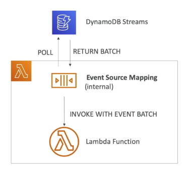

### Traditional Architecture

>  Client <=> API Layer (EC2 + ASG + ELB) <=> Database Layer (RDS - MySQL, PostgreSQL, etc...)

Traditional applications leverage RDBMS databases. These databases have the SQL query language.

- Strong requirements about how the data should be modelled.
- Ability to do join, aggregations, computations
- Vertical scaling (means usually getting a more powerful CPU/ RAM/ IO)

### NoSQL databases

NoSQL doesn't mean no SQL but not only SQL.

- NoSQL databases are non-relational databases and are distributed.
- NoSQL databases include MongoDB, DynamoDB, etc.
- NoSQL databases do not support join
- All the data that is needed for a query is present in one row.
- NoSQL databases don't perform aggregations such as "SUM"
- NoSQL databases scale horizontally 

There's no "right or wrong" for NoSQL vs SQL, they just require to model the data differently and think about user queries differently.

## DynamoDB

NoSQL Serverless Database.

- NoSQL database - not a relational database
- Fully managed(the database is already there, you don't have to create), highly available with replication across 3 AZ
- Scales to massive workloads, distributed database
- Millions of requests per seconds, trillions of row, 100s of TB of storage
- Fast and consistent in performance (low latency on retrieval)
- Integrated with IAM for security, authorisation and administration
- Enables event driven programming with DynamoDB Streams
- Low cost and auto scaling capabilities

### DynamoDB Basics

DynamoDB is made of tables.

- Each table has a **primary key** (must be decided at creation time)
- Each table can have an infinite number of items (=rows)
- Each item has attributes (can be added over time -  can be null)
- Maximum size of a item is 400 KB
- Data types supported are:
  - Scalar Types: String, Number, Binary, Boolean, Null
  - Document Types: List, Map
  - Set Types: String Set, Number Set, Binary Set

### DynamoDB - Primary Keys

Option 1: partition key only (HASH).

- Partition key must be unique for each item
- Partition key must be "**diverse**" so that the data is **distributed**
- e.g.: user_id for a users table (then has attributes of the user)

Option 2: Partition key + Sort Key

- The combination must be unique
- Data is grouped by partition key
- Sort key == range key
- E.g.: users-games table
  - user_id for the partition key
  - game_id for the sort key
  - then has attributes like result (win, lose..)

### DynamoDB - Provisioned Throughput

Table must have provisioned read and write capacity units.

- **Read Capacity Units (RCU):** throughput for reads

- **Write Capacity Units (WCU):** throughput for writes

Option to setup auto-scaling of throughput to meet demand. Throughput can be exceeded temporarily using "burst credit". If burst credit are empty, you'll get a "ProvisionedThroughputException". It's then advised to do an exponential back-off retry.

#### DynamoDB - Write Capacity Units

One *write capacity unit* represents one write per second for an item up to 1 KB in size. If the items are larger than 1 KB, more WCU are consumed.

e.g. 1: write 10 objects per seconds of 2 KB each => need $10 * 2 = 20 WCU$

e.g. 2: write 6 objects per second of 4.5 KB each => need $6 * 5 = 30 WCU$ (4.5 gets rounded to upper KB)

e.g. 3: write 120 objects per minute of 2 KB each => need $120 / 60 * 2 = 4 WCU$

#### DynamoDB - Strong Consistent Read vs Eventually Consistent Read

**Eventually Consistent Read:** if we read just after a write, it's possible we'll get unexpected response because of replication.

**Strong Consistent Read:** if we read just after a write, we will get the correct data.

By default, DynamoDB uses Eventually consistent Read, but `GetItem`, `Query` & `Scan` provide a "ConsistentRead" parameter you can set to `True`.

#### DynamoDB - Read Capacity Units

One *read capacity unit* represents one strongly consistent read per second, or two eventually consistent reads per second, for an item up to 4 KB in size. If the items are larger than 4 KB, more RCU are consumed.

e.g. 1: 10 strongly consistent read per seconds of 4 KB each. => $10*4 KB / 4 KB = 10 RCU$

e.g. 2: 16 eventually consistent reads per seconds of 12 KB each => $(16/2)*(12/4) = 24 RCU$

e.g. 3: 10 strongly consistent reads per seconds of 6 KB each => $10 * 8 KB / 4 KB = 20 RCU$ (round up 6 KB to 8 KB, 4 KB increment)

#### DynamoDB - Partitions Internal

Data is divided in partitions. Partition keys go through a hashing algorithm to know to which partition they go to. To compute the number of partitions:

- By capacity: (Total RCU / 3000) + (TOTAL WCR / 1000)
- By size: Total Size / 10 GB
- Total partitions = CEILING(MAX(Capacity, Size))
- WCU and RCU are spread evenly between partitions

#### DynamoDB - Throttling

If we exceed our RCU or WCU, we get "ProvisionedThrouputExceededExceptions".

Reasons:

- Hot keys: one partition key is being read too many times (popular item for ex)
- Hot partitions
- Very large items: remember RCU and WCU depends on size of items

Solutions:

- Exponential back-off when exception is encountered (already in SDK)
- Distribute partition keys as much as possible
- If RCU issue, we can use DynamoDB Accelerator (DAX)

### DynamoDB - Basic APIs

#### Writing Data

- **PutItem** - Write data to DynamoDB (create data or full replace)
  - Consumes WCU
- **UpdateItem** - Update data in DynamoDB (partial update of attributes)
  - Possibility to use Atomic Counters and increase them
- **Conditional Writes**
  - Accept a write / update only if conditions are respected, otherwise reject
  - Helps with concurrent access to items
  - No performance impact

#### Deleting Data

- **DeleteItem**
  - Delete an individual row
  - Ability to perfom a conditional delete
- **DeleteTable**
  - Delete a whole table and all its items
  - Much quicker deletion than calling DeleteItem on all items

#### Batching Writes

- **BatchWriteItem**
  - up to 25 PutItem and/ or DeleteItem in one call
  - Up to 16 MB of data written
  - Up to 400 KB of data per item

Batching allows you to save in latency by reducing the number of API calls done against DynamoDB. Operations are done in parallel for better efficiency. It's possible for part of batch to fail, in which case we have the try the failed items (using exponential back-off algorithm)

#### Reading Data

- **GetItem**
  - Read based on Primary key
  - Primary Key = HASH or HASH-RANGE
  - Eventually consistent read by default
  - Option to use strongly consistent reads (more RCU - might take longer)
  - **ProjectionExpression** can be specified to include only certain attributes
- BatchGetItem
  - Up to 100 items
  - Up to 16 MB of data
  - Items are retrieved in parallel to minimise latency

#### Query

- Query returns items based on:
  - PartitionKey value (must be = operator)
  - SortKey value (=, <, <=, >, >=, Between, Begin) - optional
  - FilterExpression to further filter (client side filtering)
- Returns:
  - Up to 1 MB of data
  - Or number of items specified in Limit
- Able to do pagination on results
- Can query table, a local secondary index, or a global secondary index

#### Scan

Scan the entire table and then filter out data (inefficient).

- Returns up to 1 MB of data - use pagination to keep on reading
- Consumes a lot of RCU
- Limit impact using Limit or reduce the size of the result and pause
- For faster performance, use **parallel scans**
  - Multiple instances scan multiple partitions at the same time
  - Increases the throughput and RCU consumed
  - Limit the impact of parallel scans just like you would for Scans
- Can use a **ProjectionExpression + FilterExpression** (no change to RCU)

### DynamoDB - LSI (Local Secondary Index)

Alternate range key for your table, local to the hash key (partition key).

- Up to 5 local secondary indexes per table.
- The sort key consists of exactly one scalar attribute
- The attribute that you choose must be a scalar String, Number, or Binary
- LSI must be defined at table creation time

### DynamoDB - GSI (Global Secondary Index)

To speed up queries on non-key attributes, use a Global Secondary Index.

- GSI = partition key + optional sort key
- The index is a new "table" and we can project attributes on it
  - The partition key and sort key of the original table are always projected (KEYS_ONLY)
  - Can specify extra attributes to project (INCLUDE)
  - Can use all attributes from main table (ALL)
- Must define RCU/ WCU for the index
- Possibility to add/ modify GSI (not LSI)

For example, a table with partition key `user_id`, sort key `game_id` and attribute `game_ts` (query by user_id) can have an index with partition key `game_id`, sort key `game_ts` and attribute `user_id` (query by game_id).

### DynamoDB Indexes and Throttling

GSI:

- If the writes are throttled on the GSI, then the main table will be throttled
- Even if the WCU on the main tables are fine
- Choose your GSI partition key carefully
- Assign your GSI WCU capacity carefully

LSI:

- Uses the WCU and RCU of the main table
- No special throttling considerations  

### DynamoDB Optimistic Concurrency

DynamoDB has a feature called "Conditional Update/ Delete". That means that you can ensure an item hasn't changed before altering it. That makes DynamoDB an **optimistic locking**/ concurrency database.

### DynamoDB - DAX

DynamoDB Accelerator.

- Seamless cache for DynamoDB, no application rewrite.
- Writes go through DAX to DynamoDB
- Micro second latency for cached reads & queries
- Solves the Hot Key problem (too many reads)
- 5 minutes TTL for cache by default
- Up to 10 nodes in the cluster
- Multi AZ (3 nodes minimum recommended for production)
- Secure (Encryption at rest with KMS, VPC, IAM, CloudTrail)

#### DAX vs ElastiCahce

DAX - Individual objects cache, Query/ Scan cache

ElastiCache - Store Aggregation Result

### DynamoDB Streams

Changes in DynamoDB (Create, Update, Delete) can end up in a DynamoDB Stream.

- This stream can be read by AWS lambda & EC2 instances, and we can then do
  - React to changes in real time (welcome email to new users
  - Analytics
  - Create derivative tables/ views
  - Insert into ElasticSearch
- Cloud implement cross region replication using Streams
- Stream has 24 hours of data retention

You need to choose the information that will be written to the stream whenever the data in the table is modified:

- KEYS_ONLY - Only the key attributes of the modified item
- NEW_IMAGE - The entire item, as it appears after it was modified
- OLD_IMAGE - The entire item, as it appeared before it was modified
- NEW_AND_OLD_IMAGES - Both the new and old images of the item

DynamoDB Streams are made of shards, just like Kinesis Data Streams. You don't provision shards, this is automated by AWS. Records are not retroactively populated in a stream after enabling it.

#### DynamoDB Streams & Lambda

You need to define an Event Source Mapping to read from a DynamoDB Streams. You need to ensure the Lambda function has the appropriate permissions. The Lambda function is invoked synchronously.



### DynamoDB - TTL (Time to Live)

TTL = automatically delete an item after an expiry date/ time. TTL is a background task operated by DynamoDB service itself. TTL is provided at no extra cost, deletions do not use WCU/ RCU.

- Helps reduce storage and manage the table size over time.
- Helps adhere to regulatory norm.
- TTL is enabled per row (you define a TTL column, and add a date there)

DynamoDB typically deletes expired items within 48 hours of expiration. Deleted items due to TTL are also deleted in GSI/ LSI. DynamoDB Streams can help recover expired items.

### DynamoDB CLI

- --projection-expression: attributes to retrieve

  - ```bash
    $ aws dynamodb scan --table-name TableName --projetion-expression "primary_key, column1" --region ap-southeast-2
    ```

- --filter-expression: filter results

  - ```bash
    $ aws dynamodb scan --table-name TableName --filter-expression "user_id = :u" --expression-attribute-values '{":u": {"S":"user123"}}' --region ap-southeast-2
    ```

General CLI pagination options including DynamoDB/ S3:

- Optimisation

  - --page-size: full dataset is still received but each API call will request less data (helps avoid timeouts)

  - $NumberOfAPICall = total\_rows / page\_size$

  - ```bash
    $ aws dynamodb scan --table-name TableName --region ap-southeast-2 --page-size 1
    ```

- Pagination:

  - --max-items: max number of results returned by the CLI. Returns `NextToken`

    - ```bash
      $ aws dynamodb scan --table-name TableName --region ap-southeast-2 --max-items 1
      ```

  - --starting-token: specify the last received `NextToken` to keep on reading

    -  ```bash
      $ aws dynamodb scan --table-name TableName --region ap-southeast-2 --max-items 1 --starting-token prev_NextToken
       ```

### DynamoDB Transactions

Transaction = Ability to Create/ Update/ Delete multiple rows in different tables at the same time. It's an "all or nothing" type of operation.

- Write Modes: Standard, Transactional
- Read Modes: Eventual Consistency, Strong Consistency, Transactional
- Consume 2x of WCU/ RCU

### DynamoDB as Session State Cache

It's common to use DynamoDB to store session state.

- vs ElastiCache
  - ElastiCache is in-memory, but DynamoDB is serverless
  - Both are key/value stores

- vs EFS
  - EFS must be attached to EC2 instances as network drive

- vs EBS & Instance Store
  - EBS & Instance Store can only be used for local caching, not shared caching
- vs S3
  - S3 is higher latency, and not meant for small objects

### DynamoDB - Write Types

- Concurrent Writes
  - Later ones overwrite the previous

- Conditional Writes
  - First one gets accepted later ones fails
- Atomic Writes
  - instead of set value, use INCREASE BY x, all will success
- Batch Writes

### DynamoDB - Large Objects pattern

Send large data to S3 and send small metadata to DynamoDB.

#### DynamoDB Operations

- Table Cleanup
  - Option 1: Scan + Delete => very slow, expensive, consumes RCU & WCU
  - Option 2: Drop Table + Recreate table => fast, cheap, efficient
- Copying a DynamoDB Table
  - Option 1: Use AWS DataPipeline (uses EMR)
    - Exporting Data from DynamoDB to Amazon S3 through EMR
    - then Importing Data from Amazon S3 to DynamoDB through EMR
  - Option 2: Create a backup and restore the backup into a new table name (can take some time)
  - Option 3: Scan + Write => write own code

### DynamoDB - Security & Other features

- Security
  - VPC Endpoints available to access DynamoDB without internet
  - Access fully controlled by IAM
  - Encryption at rest using KMS
  - Encryption in transit using SSL / TLS
- Backup and Restore feature available
  - Point in time restore like RDS
  - No performance impact
- Global Tables
  - Multi region, fully replicated, high performance
- Amazon DMS can be used to migrate to DynamoDB (from Mongo, Oracle, MySQL, S3, etc...)
- You can launch a local DynamoDB on your computer for development purpose