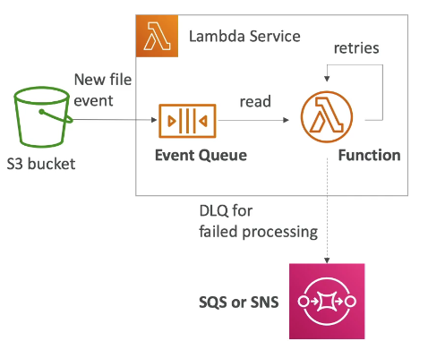
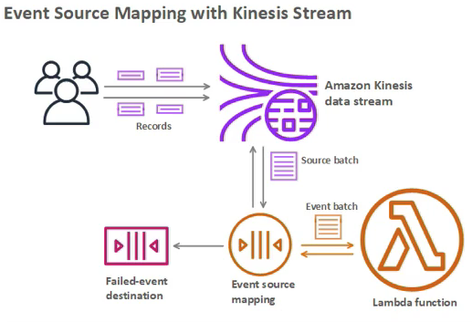
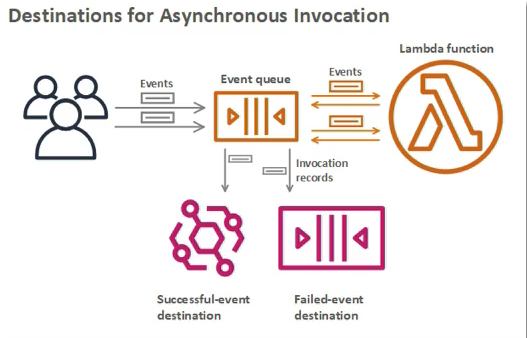

## Serverless

Serverless is a new paradigm in which the developers don't have to manage servers anymore. They just deploy code/ functions.

Initially, Serverless == FaaS (Function as a Service). Serverless was pioneered by AWS Lambda but now also includes anything that's managed "databases, messaging, storage, etc.".

Serverless doesn't mean there are no servers, it means you don't manage/ provision/ see them.

### Serverless in AWS

- AWS Lambda
- DynamoDB
- AWS Cognito
- AWS API Gateway
- Amazon S3
- AWS SNS & SQS
- AWS Kinesis Data Firehose
- Aurora Serverless
- Step Functions
- Fargate

## AWS Lambda

### Why AWS Lambda

| Amazon EC2                                        | Amazon Lambda                            |
| ------------------------------------------------- | ---------------------------------------- |
| Virtual Servers in the Cloud                      | Virtual functions - no servers to manage |
| Limited by RAM and CPU                            | Limited by time - short executions       |
| Continuously running                              | Run on-demand                            |
| Scaling means intervention to add/ remove servers | Scaling in automated                     |

### Benefits of AWS Lambda

- [Easy Pricing](https://aws.amazon.com/lambda/pricing):
  - Pay per request and compute time (in increment of 100 ms)
    - Free tier of 1,000,000 AWS Lambda requests and 400,000 GBs of compute time
    - $0.20 per 1million requests thereafter
    - $1.0 for 600,000 GB-seconds (600,000s if function is 1GB RAM)  
- Integrated with the whole AWS suite of services
  - API Gateway, Kinesis, DynamoDB, S3, CloudFront, CloudWatch Events EventBridge, CloudWatch Logs, SNS, SQS, Cognito...
- Integrated with many programming languages
  - Node.js, Python, Java, C# (.NET Core), Golang, Powershell, Ruby, Custom Runtime API (community supported, e.g. Rust)
- Easy monitoring through AWS CloudWatch
- Easy to get resources per functions (up to 3GB of RAM)
- Increasing RAM will also improve CPU and network

### Lambda categories

- Synchronous Invocation
- Asynchronous Invocation
- Event Source Mapping

### Lambda - Synchronous Invocations

Synchronous (invoked from CLI, SDK, API Gateway, Application Load Balancer):

- Result is returned right away
- Error handling must happen client side (retries, exponential backoff, etc...)

#### Synchronous Invocations Services

- User Invoked
  - Elastic Load Balancing (Application Load Balancer)
  - Amazon API Gateway
  - Amazon CloudFront (Lambda@Edge)
  - Amazon S3 Batch
- Service Invoked
  - Amazon Cognito
  - AWS Step Functions
- Other services
  - Amazon Lex
  - Amazon Alexa
  - Amazon Kinesis Data Firehose

#### From CLI

```bash
$ aws lambda invoke --function-name func-name --cli-binary-format raw-in-base64-out --payload '{"key1": "value1", "key2": "value2", "key3": "value3"}' --region au-southeast-2 response.json
```


#### Lambda Integration with ALB

To expose a Lambda function as an HTTP(S) endpoint, you can use the Application Load Balancer (or an API Gateway). The Lambda function must be registered in a target group.

Client <--HTTP/HTTPS--> ALB <--Invoke Sync--> Lambda in a Target Group

From ALB to Lambda: HTTP to JSON, From Lambda to ALB: JSON to HTTP.

##### ALB Multi-Header Values

ALB can support multi header values (ALB settings). When it is enabled, HTTP headers and query string parameters that are sent with multiple values are shown as arrays within the AWS Lambda event and response objects.

For example, in http://example.com/path?name=foo&name=bar, parameter `name` has multiple value. It will be converted into `"queryStringparameters":{"name": ["foo", "bar"]}` from ALB to Lambda.

#### Lambda@Edge

You have deployed a CDN using CloudFront. What if you wanted to run a global AWS Lambda alongside? Or how to implement request filtering before reaching your application? You can use Lambda@Edge: deploy Lambda functions alongside your CloudFront CDN. 

- Build more responsive applications
- You don't manage servers
- Customise the CDN content
- Pay only for what you use

You can use Lambda@Edge  to change CloudFront requests and responses:

- After CloudFront receives a request from a viewer (viewer request)

- Before CloudFront forwards the request to the origin (origin request)
- After CloudFront receives the response from the origin (origin response)
- Before CloudFront forwards the response to the viewer (viewer response)

You can also generate responses to viewers without ever sending the request to the origin.

##### Use Cases

- Website Security and Privacy

- Dynamic Web Application at the Edge

- Search Engine Optimisation (SEO)
- Intelligently Route Across Origins and Data Centers
- Bot Mitigation at the Edge
- Real-time Image Transformation
- A/B Testing
- User Authentication and Authorisation
- User Prioritisation
- User Tracking and Analytics

### Lambda Asynchronous Invocations

From S3, SNS, CloudWatch Events... The events are placed in an `Event Queue`. Lambda attempts to retry on errors:

- 3 tries total
- 1 minute wait after 1st, then 2 minutes wait

Make sure the processing is idempotent (in case of retries). If the function is retried, you will see duplicate logs entries in CloudWatch Logs. Can define a DLD (Dead-Letter Queue) - SNS or SQS - for failed processing (need correct IAM permissions).



Asynchronous invocations allows you to speed up the processing if you don't need to wait for the result (ex. you need 1000 files processes).

#### Asynchronous Invocations Services

**S3, SNS, CloudWatch Events/ EventBridge**, CodeCommit (new branch, tag, push), CodePipeline (invoke a lambda function during the pipeline, Lambda must callback)

Others: CloudWatch Logs, Simple Email Service, CloudFormation, Config, IoT, IoT Events

##### From CLI

```bash
$ aws lambda invoke --function-name func-name --cli-binary-format raw-in-base64-out --payload '{"key1": "value1", "key2": "value2", "key3": "value3"}' --invocation-type Event --region au-southeast-2 response.json
```

`--invocation-type Event` is the difference.

### Lambda - Event Source mapping

Applies to Kinesis Data Streams, SQS & SQS FIFO queue and DynamoDB Streams. And in this case, Lambda is invoked synchronously.

Common denominator: records need to be polled from the source.

Two categories:

- Streams
- Queue

#### Streams & Lambda: (Kinesis & DynamoDB)

An event source mapping creates an iterator for each shard, processes items in order at shard level. Start with new items, from the beginning or from time stamp.

- Processed items aren't remove from the stream (other consumers can read them)

- When Low traffic: use batch window to accumulate records before processing.
- When High traffic: You can process multiple batches in parallel
  - Up to 10 batches per shard
  - in-order processing is still guaranteed for each partition key

##### Streams & Lambda - Error Handling

By default, if your function returns an error, the entire batch is reprocessed until the function succeeds, or the items in the batch expire. To ensure in-order processing, processing for the affected shard is paused until the error is resolved. You can configure the event source mapping to:

- discard old events
  - Discarded events can go to a Destination
- restrict the number of retries
- split the batch on error (to work around Lambda timeout issues)



#### Queue & Lambda: (SQS & SQS FIFO)

Lambda scales up to process a standard queue as quickly as possible. Lambda also supports in-order processing for FIFO queues, scaling up to the number of active message groups.

Event Source Mapping will poll SQS (Long Polling).

- Specify batch size (1-10 messages).
- Recommended: Set the queue visibility timeout to 6x the timeout of your Lambda function
- To use a DLQ
  - Set-up on the SQS queue, not Lambda (DLQ for Lambda only works for async invocations)
  - Or use a Lambda destination for failures

When an error occurs, batches are returned to the queue as individual items and might be processed in a different grouping than the original batch. Occasionally, the event source mapping receive the same item from the queue twice, even if no function error occurred. Finally, Lambda deletes items from the queue after they're processed successfully. You can configure the source queue to send items to a dead-letter queue if they can't be processed.  

#### Lambda Event Mapper Scaling

- Kinesis Data Streams & DynamoDB Streams
  - One Lambda invocation per stream shard
  - If parallelisation, up to 10 batches processed per shard simultaneously
- SQS Stand
  - Lambda adds 60 more instances per minute to scale up
  - Up to 1000 batches of messages processed sinultaneously
- SQS FIFO
  - Messages with the same GroupID will be processed in order
  - The Lambda function scales to the number of active message groups

### Lambda Destinations

When doing asynchronous invocations or event mapper, it is hard to see if it has failed or succeeded.

[**Asynchronous invocations:**](https://docs.aws.amazon.com/lambda/latest/dg/invocation-async.html) can define destinations for successful and failed event as

- SQS/ SNS/ Lambda or EventBridge Bus

Note: AWS recommends you use destinations instead of DLQ now, because it has more options (but both can be used at the same time)



[**Event Source mapping:**](https://docs.aws.amazon.com/lambda/latest/dg/invocation-eventsourcemapping.html) for discarded event batches:

- SQS/ SNS

Note: you can send events to a DLQ directly from SQS 

### Lambda Permissions

#### Execution Role (IAM Role)

Grants the Lambda function permissions to AWS services/ resources.

When you use an event source mapping to invoke your function, Lambda uses the execution role to read event data. 

Best practice: create on Lambda Execution Role per function.

#### Resource Based Policies

Use resource-based policies to give other accounts and AWS services permission to use your Lambda resources. An IAM principal can access Lambda:

- if the IAM policy attached to the principal authorises it (e.g. user access)
- Or if the resource-based policy authorises (e.g. service access)

### Lambda Environment Variables

Adjust the function behaviour without updating code. Lambda Services adds its own system environment variables as well.

- Helpful to store secrets (encrypted by KMS)
- Secrets can be encrypted by the Lambda service key, or your own CMK

### Lambda monitoring

- CloudWatch Logs:
  - AWS lambda execution logs are stored in AWS CloudWatch Logs
  - Make sure your AWS Lambda function has an execution role with an IAM policy that authrises writes to CloudWatch Logs
- CloudWatch Metrics:
  - AWS Lambda metrics are displayed in AWS CloudWatch Metrics
  - Invocations, Duration, Concurrent Executions
  - Error count, Success Rates, Throttles
  - Async Delivery Failures
  - Iterator Age (Kinesis & DynamoDB Streams) 

###  Lambda Tracing with  X-Ray

- Enable in Lambda configuration (Active Tracing).

- Runs the X-Ray daemon for you.
- Use AWS X-Ray SDK in Code.
- Ensure Lambda Function has a correct IAM Execution Role
  - The managed policy is called AWSXRayDaemonWriteAccess
- Environment variables to communicate with X-Ray
  - \_X\_AMZN\_TRACE\_ID: contains the tracing header
  - AWS\_XRAY\_CONTEXT\_MISSING: by default, `LOG_ERROR`
  - AWS\_XRAY\_DAEMON\_ADDRESS: the X-Ray Daemon `IP_ADDRESS:PORT`

### Lambda in VPC

By default, your Lambda function is launched outside your own VPC (in an AWS-owned VPC). Therefore it cannot access resources in your VPC (RDS, ElastiCache, internal ELB...). In order to do that, you must define the VPC ID, the Subnets and the Security Groups.

- Lambda will create an ENI (Elastic Network Interface) in your subnets
- AWSLambdaVPCAccessExecutionRole 

#### Lambda in VPC - Internet Access

A Lambda function in your VPC does not have internet access. Deploying a Lambda function in a public subnet does not give it internet access or a public IP. But you can deploy a Lambda function in a private subnet gives it internet access if you have a NAT Gateway/ Instance. You can use VPC endpoints to privately access AWS services without a NAT.  

### Lambda Function Configuration

- **RAM:**
  - From 128 MB to 3008 MB in 64 MB increments
  - The more RAM you add, the more vCPU credits you get
  - At 1,792 MB, a function has the equivalent of one full vCPU
  - After 1,792 MB, you get more than one CPU, and need to use multi-threading in your code to benefit from it.
- If your application is CPU-bound (computation heavy), increase RAM
- **Timeout:** default 3 seconds, maximum is 900 seconds (15 minutes)

### Lambda Performance

The **execution context** is a temporary runtime environment that initialises any external dependencies of your lambda code.

- You can use it to create for database connections, HTTP clients, SDK clients...
- The execution context is maintained for some time in anticipation of another Lambda function invocation
- The next function invocation can "re-use" the context to execution time and save time in initialising connections objects
- The execution context includes the `/tmp` directory

#### Initialise outside the handler

```python
import os

def get_user_handler(event, context):
  # BAD! The DB connection is established at every function invocation
	DB_URL = os.getenv("DB_URL")
	db_client = db.connect(DB_URL)
	user = db_client.get(user_id = event["user_id"])
	return user
```

```python
import os

DB_URL = os.getenv("DB_URL")
db_client = db.connect(DB_URL)		# Good! The DB connection is established once
																	# and re-use across invocations
	
def get_user_handler(event, context):
	user = db_client.get(user_id = event["user_id"])
	return user
```

#### Lambda Functions `/tmp` space

If your Lambda function needs to download a big file to work or needs disk space to perform operations, you can use the `/tmp` directory.

- Max size is 512 MB
- The directory content remains when the execution context is frozen, providing transient cache that can be used for multiple invocations (helpful to checkpoint your work)
- For permanent persistence of object use S3

### Lambda Concurrency

Concurrency limit: up to 1000 concurrent executions at the account level for each region. If you need a higher limit, open a support ticket.

- Can set a "reserved concurrency" at the function level (=limit).
- Each invocation over the concurrency limit will trigger a "Throttle"
- Throttle behavior:
  - If synchronous invocation => return ThrottleError - 429
  - If asynchronous => retry automatically and then go to DLQ

#### Lambda Concurrency Issue

If you don't reserve (=limit) concurrency, the following can happen: one Lambda function may occupy all the concurrent executions and all other Lambdas trigger Throttle.

#### Concurrency and Asynchronous Invocations

If the function doesn't have enough concurrency available to process all events, additional request are throttled. For throttling errors (429) and system errors (500-series), Lambda returns the event to the queue and attempts to run the function again for up to 6 hours. The retry interval increases exponentially from 1 second after the first attempt to a maximum of 5 minutes.

### Cold Starts & Provisioned Concurrency

- Cold Start:
  - New instance => code is loaded and code outside the handler run (init)
  - If the init is large (code, dependencies, SDK...) this process can take some time
  - First request served by new instances has higher latency that the rest
- Provisioned Concurrency
  - Concurrency is allocated before the function is invoked (in advance)
  - So the cold start never happens and all invocations have low latency
  - Application Auto Scaling can manage concurrency (schedule or target utilisation)
- Note:
  -  Cold starts in VPC have been dramatically reduced in Oct & Nov 2019
  - https://aws.amazon.com/blogs/compute/announcing-improved-vpc-networking-for-aws-lambda-functions/

##### [Reserved and Provisioned Concurrency](https://docs.aws.amazon.com/lambda/latest/dg/configuration-concurrency.html)

### Lambda Function Dependencies

If your lambda function depends on external libraries, for example AWS X-Ray SDK, Database Clients, etc... You need to install the packages alongside your code and zip it together

- For Node.js, use `npm` & "node_modules" directory
- For Python, use `pip --target` options
- For Java, include the relevant `.jar` files

Upload the zip straight to Lambda if less than 50 MB, otherwise to S3 first.

- Native libraries work: they need to be compiled on Amazon Linux
- AWS SDK comes by default with every Lambda function

### Lambda and CloudFormation

#### Inline

Define a simple Lambda function inline of CloudFormation template using the `Code.ZipFile` property. You cannot include function dependencies with inline functions.

```yaml
AWSTemplateFormatVersion: '2010-09-09'
Description: Lambda function inline
Resource:
	primer:
		Type: AWS::Lambda::Function
		Properties:
			Runtime: python3.x
			Role: arn:aws:iam::123456789012:role/lambda-role
			Handler: index.handler
			Code:
				ZipFile: |
					import os
					DB_URL = os.getenv("DB_URL")
					db_client = db.connect(DB_URL)
					def handler(evene, context):
						user = db_client.get(user_id = event["user_id"])
						return user
```

#### S3

You must store the Lambda zip in S3. You must refer the S3 zip location in the CloudFormation code:

- S3Bucket
- S3Key: full path to zip
- S3ObjectVersion: if versioned bucket

```yaml
AWSTemplateFormatVersion: '2010-09-09'
Description: Lambda function from #3
Resource:
	primer:
		Type: AWS::Lambda::Function
		Properties:
			Runtime: python3.x
			Role: arn:aws:iam::123456789012:role/lambda-role
			Handler: index.handler
			Code:
				S3Bucket: my-bucket
				S3Key: function.zip
				S3ObjectVersion: String
```

### Lambda Layers

It allows two things:

1. Custom Runtimes
2. Externalise Dependencies to re-use them
   - Originally: Application Package1 = app.py + heavy_lib1 files + heavy_lib2 files
   - With layers: Application Package1 only has app.py 
     - It reference a lambda Layer 1 with heavy_lib1 files
     - and a Lambda Layer 2 with heavy_lib2 files
     - And these layers can be shared with other packages

### Lambda Versions

When you work on a Lambda function, we work on $LATEST (mutable). When we are ready to public a Lambda function, we create a version.

- Versions are immutable (code + configuration)
- Versions have increasing version numbers
- Versions get their own ARN

#### Lambda Aliases

Aliases are "pointers" to Lambda function versions. We can define a "dev", "test", "prod" aliases and have them point at different lambda versions.

- Aliases are mutable.
- Aliases enable Blue/ Green deployment by assigning weights to Lambda Functions. 
- Aliases enable stable configuration of our event triggers/ destinations
- Aliases have their own ARNs
- Aliases cannot reference aliases

### Lambda and CodeDeploy

CodeDeploy can help you automate traffic shift for Lambda aliases. Feature is integrated within the SAM framework.

- AllAtOnce
- Linear: grow traffic every N minutes until 100%
  - Linear10PercentEvery3Minutes
  - Linear10PercentEvery10Minutes
- Canary: try X percent then 100%
  - Canary10Percent5minutes
  - Canary10Percent30minutes

Can create Pre & Post Traffic hooks to check the health of the Lambda function.

### Lambda Limits - per region

- Execution
  - Memory allocation: 128 MB - 3008MB (64 MB increments)
  - Maximum execution time: 900 seconds
  - Environment variables (4 KB)
  - Disk capacity in the "function container" (in /tmp): 512 MB
  - Concurrency execution: 1000 (can be increased)
- Deployment
  - Lambda function deployment size (compressed .zip): 50 MB
  - Size of uncompressed deployment (code + dependencies): 250 MB
  - Can use the /tmp directory to load other files at startup
  - Size of environment variables: 4 KB

### Lambda Best Practices

- Perform heavy-duty work outside of your function handler, e.g.:
  - Connect to DB
  - Initialise the AWS SDK
  - Pull in dependencies or datasets
- Use environment variables for:
  - DB connection Strings, S3 bucket, etc... (don't put these values in your code)
  - Passwords, sensitive values can be encrypted using KMS
- Minimise your deployment package size to its runtime necessitties
  - Break down the function if needed
  - Remember the AWS Lambda limits
  - Use Layers where necessary
- Avoid using recursive code, **never have a Lambda function call itself**!

