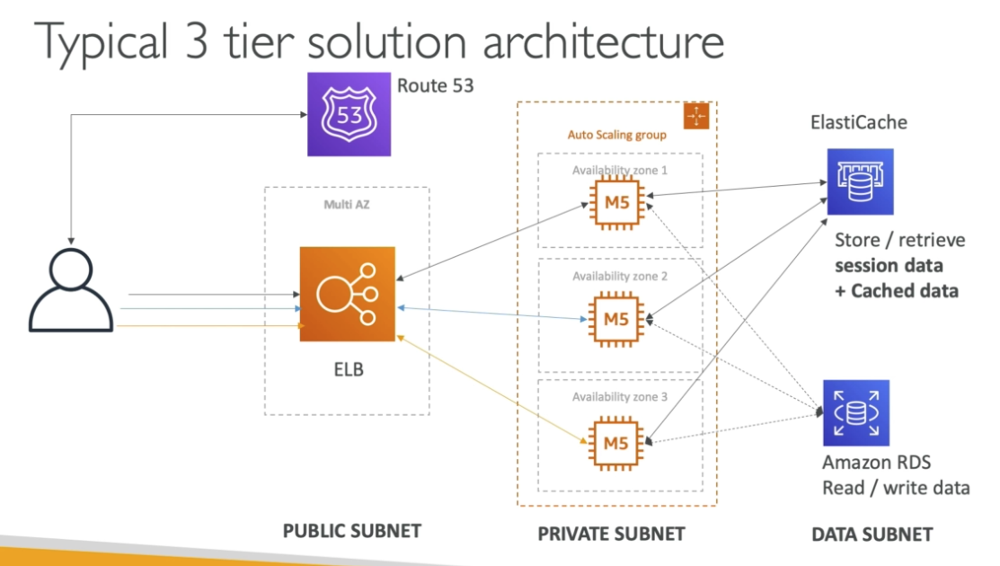

## VPC

VPC: Virtual private cloud (regional resource)

Subnets: Tied to an AZ, network partition of the VPC (AZ resource)

Public subnet - a subnet that is accessible from the internet (has 1 by default) 

Route Tables - define access to the internet and between subnets 

### Internet Gateway & NAT Gateways

Internet Gateway: at the VPC level, provide to private subnets. Helps our VPC instances connect with the internet.

Public Subnets have a route to the internet gateway.

**NAT Gateway** (AWS-managed) & NAT Instances (self-managed): give internet access to private subnets

Private subnet has a route to NAT and NAT has a route to Internet Gateway.

### Network ACL & Security Groups

Network ACL: A firewall which controls traffic from and to subnet. (1st mechanism of defence)

- Subnet rules for inbound and outbound.
- Rules only include IP addresses
- A default NACL allows everything in and out

Security Groups: A firewall that controls traffic to and from an ENI/ an EC2 instance. (2nd mechanism of defence)

- Rules include IP addresses and other security groups

| Network ACL                                                  | Security Group                                               |
| ------------------------------------------------------------ | ------------------------------------------------------------ |
| Operates at the subnet level                                 | Operates at the instances level or ENI                       |
| Supports ALLOW and DENY rules.                               | Can have only ALLOW rules                                    |
| Stateless: Return traffic must be explicitly allowed by rules | Stateful: Return traffic is automatically allowed, regardless of any rules |
| Process rules in number order when deciding whether to allow traffic | Evaluate all rules before deciding whether to allow traffic  |
| Automatically applies to all instances in the subnets it's associated with. | Applies to an instance only if someone specifies the security group to it. |

### VPC Peering

Connect two VPC, privately using ASW's network. Make them behave as if they were in the same network. To achieve that, there must not have overlapping CIDR (IP ranges) 

VPC Peering connection is not transitive (A connected with B & A connected with C. B can't talk to C naturally)

### VPC Endpoints

Allows you to connect to AWS Services within VPC using a private network instead of the public www network. This gives you enhanced security and lower latency to access AWS services.

Access to resources outside VPC:

- S3 or DynamoDB: **VPC Endpoint Gateway**
- The rest: **VPC Endpoint Interface**

### VPC Flow Logs

Network traffic logs. Capture info about IP traffic going into your interfaces:

- VPC Flow Logs
- Subnet Flow Logs
- Elastic Network Interface Flow Logs

Helps to monitor & troubleshoot connectivity issues. (Subnets to internet, subnets to subnets & internet to subnets)

Also capture network info from AWS managed interfaces: Elastic Load Balancers, ElastiCache, RDS, Aurora, etc...

Log data can go to S3/ CloudWatch Logs.

### Site to Site VPN & Direct Connect

Site to Site VPN: VPN over public internet between on-premises DC and AWS. The connection is automatically encrypted. 

Direct Connect: Direct private physical connections between on-premises and AWS. The connection is private, secure and fast.

- Goes over a private network
- Takes at least a month to establish

**Note:** Site-to-site VPN and Direct Connect cannot access VPC endpoints.

### Three Tier Architecture

